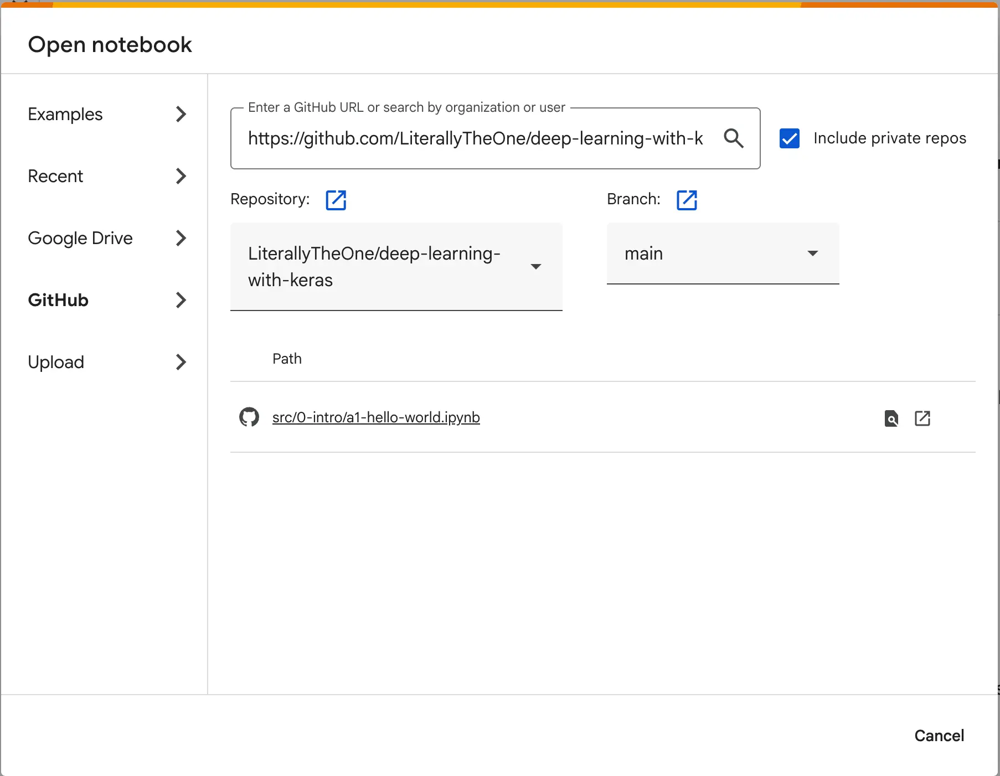

# Introduction

## Keras

**Keras** is a high-level API for building and training **Deep Learning Models**.
It is designed to be a stand-alone project.
But with the help of **TensorFlow**, **PyTorch**, and **Jax**,
It can run on top of different hardware (e.g., **CPU**, **GPU**).

The fascinating thing about **Keras** is that it is super easy to get started with.
You can train and test a model with only a few lines of code.
It is a perfect way to learn **Deep Learning** concepts by practically seeing their effects.

## Google Colab

There are so many ways available to run a **Deep Learning** code.
One of the fastest and easiest way that doesn't require any installation, is **Google Colab**.
[Google colab](https://colab.research.google.com/) is a free could-based platform that
is powered by `jupyter notebook`.
All the packages that we want for this tutorial is already installed in **Google Colab**.
Also, every code that we run in this tutorial can be run on this platform.
So, I highly recommend you to start with **Google Colab**.
After you have become more comfortable with the packages and concepts,
switch to a local platform like your personal computer.

All the codes that we talk about in this tutorial is available in the **GitHub**.
Each tutorial has a link to its respective code, which you can find it at the bottom of each page.
To load and run the codes in **Google Colab**, you can follow these steps.

* Open [Google colab](https://colab.research.google.com/)
* From **files** select **Open Notebook**
* Go to the **GitHub** section
* Copy the **URL** of the code
* Select the **.ipynb** file that you want

Here is an example of loading this tutorial's code:

