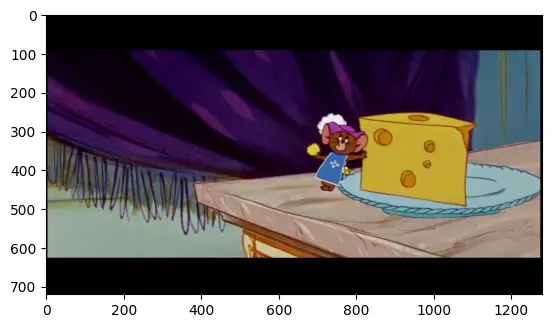
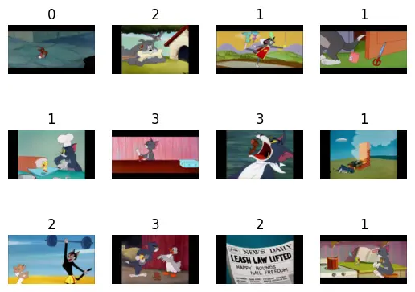

# Load an Image Classification Dataset

# Introduction

In the previous tutorial, we learned how about **Keras**, **Google Colab**, and **Kaggle**.
Our task was to select an **Image Classification Dataset** from **Kaggle**.
In this tutorial, we are going to load this dataset and make a ready to give it to a model.

## Get data from Kaggle

The easiest and the recommended way to download a dataset from **Kaggle** is to use a package called **Kagglehub**.
**Kaggle** itself has developed this package and made it super easy to use.
You can learn more about this package in their
[GitHub Repository](https://github.com/Kaggle/kagglehub).

Now, how to use this package to download a dataset.
In the dataset that you have selected, click on the **Download** button in the top right corner of the page.
A window will pop up that has a code snippet on it.
You should copy that code and use it in your own code.
For [Tom and Jerry Image classification](https://www.kaggle.com/datasets/balabaskar/tom-and-jerry-image-classification),
the is like this:

```python
import kagglehub

# Download latest version
path = kagglehub.dataset_download("balabaskar/tom-and-jerry-image-classification")

print("Path to dataset files:", path)
```

The code above, will automatically download the dataset and returns its path.
We said that we wanted a structure like below:

```text
class_a/
...a_image_1.jpg
...a_image_2.jpg
class_b/
...b_image_1.jpg
...b_image_2.jpg
```

We know that this dataset has this structure and if you looked at the dataset in **Kaggle**, you have noticed that
it is in `tom_and_jerry/tom_and_jerry` directory.
But get more familiar with the **jupyter notebook** commands, let's find it with taking the list of the path that we
are currently on.

```shell
!ls {path}


"""
--------
output: 

challenges.csv   ground_truth.csv tom_and_jerry
"""
```

As you can see, we have `tom_and_jerry` directory.
Now, let's take the list of this directory.

```shell
!ls {path}/tom_and_jerry


"""
--------
output: 

tom_and_jerry
"""
```

As you can see, we have another `tom_and_jerry` directory.
Let's take the list of it to see what's inside of it.

```shell
!ls {path}/tom_and_jerry/tom_and_jerry


"""
--------
output: 

jerry       tom         tom_jerry_0 tom_jerry_1
"""
```

And as you can see, we have reached to the structure that we wanted.
Let's put this path in a variable called `data_path`, to be able to use it later.

```python
from pathlib import Path

data_path = Path(path) / "tom_and_jerry/tom_and_jerry"
```

Your dataset might have subdirectories like `train`, `validation` and `test`.
If it was like this put the `train` directory in the `data_path` and store the other ones in their respective directory.
For example, `val_path` for validation and `test_path` for test.

## ImageFolder

One of the best ways to use an **Image Classification Dataset** in **PyTorch** is by using `ImageFolder`.
`ImageFolder` loads and assigns labels to a folder that has this structure:

```text
main_directory/
...class_a/
......a_image_1.jpg
......a_image_2.jpg
...class_b/
......b_image_1.jpg
......b_image_2.jpg
```

This structure is the structure that we have right now in our `data_path` variable.
Now, let's load our image folder and show one of the images.

```python
from torchvision.datasets import ImageFolder
from matplotlib import pyplot as plt

all_data = ImageFolder(data_path)

for image, label in all_data:
    plt.figure()
    plt.imshow(image)
    print(label)
    break

"""
--------
output: 

0
"""
```



As you can see, in the code above, we have loaded our images using `ImageFolder`
and stored it in a variable called `all_data`.
After that, we used a for to iterate through `images` and `labels`.
We showed one image and one label and used `break` to end our loop.
As it shown, the label is `0` and you can see the image representing that label in the above.

## Transforms

**Transforms** are the way that we can transform our images to the standard that we want.
For example, when we load our dataset, the images might have different sizes.
But when we want to train or test our model, we want images to have the same size.
To make this happen, we can use the `transfroms` module in `torchvison`.
For example, let's load our dataset without a resize transform with resize transfrom and see the difference.

```python
from torchvision import transforms

# Without resize transform

all_data = ImageFolder(data_path)

for image, label in all_data:
    print(f"image size without resize transform: {image.size}")
    break

# With resize transform

transform = transforms.Resize((90, 160))

all_data = ImageFolder(data_path, transform=transform)

for image, label in all_data:
    print(f"image size with resize transform: {image.size}")
    break

"""
--------
output: 

image size without resize transform: (1280, 720)
image size with resize transform: (160, 90)
"""
```

As you can see, in the code above, we have successfully changed the size of our images to `(160, 90)`.

Another thing is, when we load our images with `ImageFolder`, it would load them as `PIL` images.
But when we want to feed our images to our model, we want them to be `tensors`.
To achieve that, `torchvision` has a `transform` that take an image and turns it into a `tensor`.
To have resize and transforming to tensor transforms, we can combine them with each other like below:

```python
trs = transforms.Compose(
    [
        transforms.Resize((90, 160)),
        transforms.ToTensor(),
    ]
)

all_data = ImageFolder(data_path, transform=trs)

for image, label in all_data:
    print(type(image))
    print(image.shape)
    break

"""
--------
output: 

<class 'torch.Tensor'>
torch.Size([3, 90, 160])
"""
```

As you can see, we have our data in tensor, also the size of it is what we want it.

## Split to train, validation, test

Some of our datasets don't have **train**, **validation**, **test** subsets.
So, to split our data into these 3 subsets, we can use a function called `random_split`.
This function, takes a `Dataset`, a sequence of `lengths` to split our data, and an optional `generator`.
Here is an example on how to use `random_split`:

```python
import torch
from torch.utils.data import random_split

g1 = torch.Generator().manual_seed(20)
train_data, val_data, test_data = random_split(all_data, [0.7, 0.2, 0.1], g1)

print(f"all_data's size: {len(all_data)}")
print(f"train_data's size: {len(train_data)}")
print(f"val_data's size: {len(val_data)}")
print(f"test_data's size: {len(test_data)}")

"""
--------
output: 

all_data's size: 5478
train_data's size: 3835
val_data's size: 1096
test_data's size: 547
"""

```

In the code above, first we defined a `generator` with its seed set to `20`.
The reason for that is that we want every time that we run our code, have the same `train`, `validation`, and `test` 
subsets.
Then, we used `random_split` function.
for the first argument, we gave it `all_data` that we loaded it before.
After that, we should give it a list of percentages or lengths.
If we give it the percentages, sum of them should be equal to $1.0$.
If we give them the lengths, sum of them should be equal to the length of our data.
For example `[0.7, 0.2, 0.1]` means to split data into $70%$, $20%$, and $10%$.
We use that $70%$ for our training.
We use $20%$ for validation.
We use $10%$ for test.
For the third argument, we gave the generator that we created earlier.
As you can see in the result, we had $5478$ samples, and we split them into train, validation, and test subsets.
$3835$ of them are for training,
$1096$ of them are for validation,
and $547$ of them are for testing.

For a **Deep Learning** project, we need these 3 subsets.
If the **Dataset** provider hasn't split them already, we should split it.
Otherwise, there is nothing to do.

## DataLoader

Now, we have successfully loaded our dataset into tensors.
Also, we have train, validation, and test subsets.
Now, we are ready to feed them into our **model** for training and testing purposes.
To make this procedure easier, **PyTorch** has a module called `DataLoader`.
`Dataloader` takes a loaded dataset as its argument and helps us to apply the **Deep learning** techniques.
One these techniques is called **mini-batch**.
So, instead of feeding our data to our model one by one, we give it a **batch** of data.
For example, each time we give it **12** data.
It helps our model to learn better.
Another technique is called **shuffling**.
By **shuffling**, we change the order of data when we want to feed it to the model.
It helps the model to learn more generally.
To use `DataLoader` with these 2 techniques, we can use the code below:

```python
train_loader = DataLoader(train_data, batch_size=12, shuffle=True)
val_loader = DataLoader(val_data, batch_size=12, shuffle=False)
test_loader = DataLoader(test_data, batch_size=12, shuffle=False)
```

In the code above, we have 3 dataloaders for each train, validation, and test subsets.
Then, we set the `batch_size` to 12 and for the train subset we set the `shuffle` to `true`.
Now, let's show one batch of training data using `DataLoader`.

```python
fig, axes = plt.subplots(3, 4)

axes_ravel = axes.ravel()

for images, labels in train_loader:
    for i, (image, label) in enumerate(zip(images, labels)):
        axes_ravel[i].imshow(transforms.ToPILImage()(image))
        axes_ravel[i].set_axis_off()
        axes_ravel[i].set_title(f"{label}")
    break
```

Output:



In the code above, we made a subplot with $3$ rows and $4$ columns.
Then, we `ravel` it to make it a one dimensional array. 
This helps to use only one index instead of two.
After that, we iterate thorough our `train_loader`.
It would give us $12$ images and $12$ labels.
Then we iterate through those images and labels and show them.
As you recall, our images were in `tensor` format.
To bring them back to `PIL` format, we can use a transform called `ToPILImage`.
As you can see in the output, we have 12 different images with their respective
label on top of them.

## Your turn

Now, it is your turn.
First, get your **Kaggle** dataset.
Then, use the `ImageFolder` to load that dataset and show one of its images.
After that, if you don't have any of the **train**, **validation**, and **test** subsets,
make them using `random_split`.
Then, load those three subsets using `DataLoader` and set a `batch_size` for them.
Finally, show a batch of your data.

## Conclusion

In this tutorial, we have learned how to work with a dataset.
At first, we got an **Image classification** dataset from **Kaggle** using **Kagglehub**.
Then, we loaded that dataset using `ImageFolder`.
After that, we learned how to split our data if our dataset doesn't contain
**train**, **validation**, and **test** subsets.
Finally, we used `DataLoader` to load our data with **Deep Learning** techniques.
