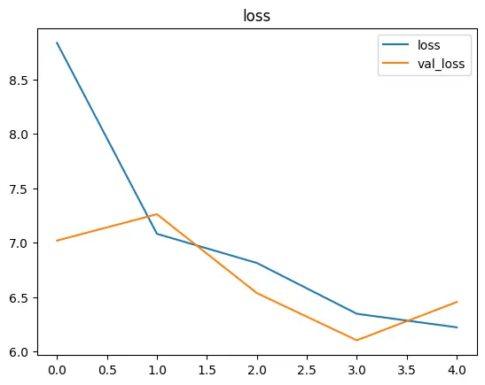
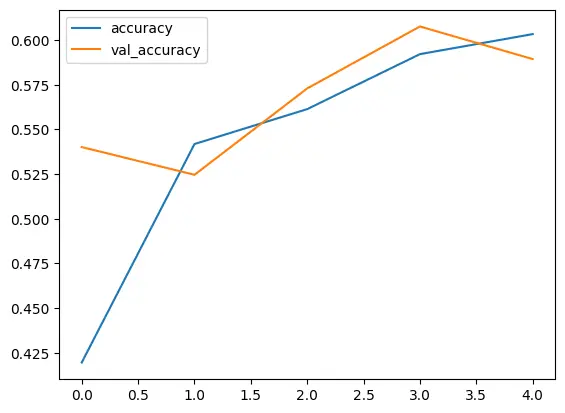
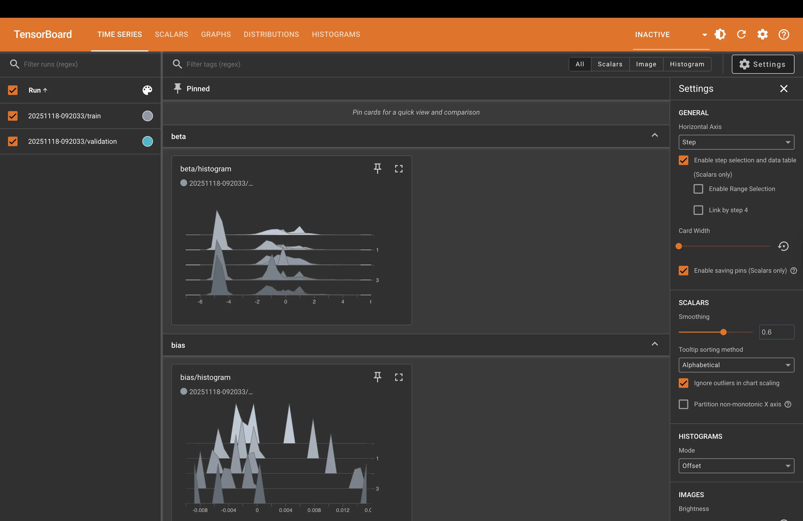
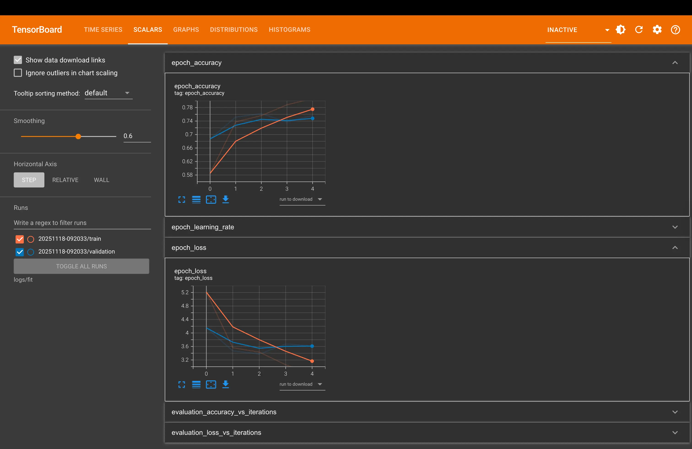

# Plot and TensorBoard

## Introduction

In the previous tutorial, we learned about **model** and **Transfer Learning**.
Here is the summary of the code that we have implemented so far.

```python
import os

os.environ["KERAS_BACKEND"] = "torch"
from pathlib import Path

from matplotlib import pyplot as plt

import torch
from torch.utils.data import random_split, DataLoader

from torchvision.datasets import ImageFolder
from torchvision import transforms

import keras
from keras import layers
from keras.applications import MobileNetV2

import kagglehub

import datetime

# Load the Dataset

path = kagglehub.dataset_download("balabaskar/tom-and-jerry-image-classification")

data_path = Path(path) / "tom_and_jerry/tom_and_jerry"

trs = transforms.Compose(
    [
        transforms.Resize((224, 224)),
        transforms.ToTensor(),
    ]
)

all_data = ImageFolder(data_path, transform=trs)

g1 = torch.Generator().manual_seed(20)
train_data, val_data, test_data = random_split(all_data, [0.7, 0.2, 0.1], g1)

train_loader = DataLoader(train_data, batch_size=12, shuffle=True)
val_loader = DataLoader(val_data, batch_size=12, shuffle=False)
test_loader = DataLoader(test_data, batch_size=12, shuffle=False)

# Create the model

base_model = MobileNetV2(include_top=False, input_shape=(224, 224, 3))

base_model.trainable = False

model = keras.Sequential(
    [
        layers.Input(shape=(3, 224, 224)),
        layers.Permute((2, 3, 1)),
        base_model,
        layers.Flatten(),
        layers.Dense(4, activation="softmax"),
    ]
)

model.compile(
    optimizer="adam",
    loss="sparse_categorical_crossentropy",
    metrics=["accuracy"],
)

# Train the model

history = model.fit(train_loader, epochs=5, validation_data=val_loader)

# Evaluate the model

loss, accuracy = model.evaluate(test_loader)

print("loss:", loss)
print("accuracy:", accuracy)
```

As you can see, in the code above, when we were training our model using `.fit` function,
we were storing its result in a variable called `history`.
In this tutorial, we will learn more about `history` and how to plot its results.
Also, we will learn about a very powerful tool for plotting and seeing the results during training,
called **TensorBoard**.

## Plot the training history

First, let's print the history to see what is inside it.

```python
print(history)

"""
--------
output: 

<keras.src.callbacks.history.History object at 0x12de7e300>
"""
```

As you can see, we have a `Callback` with the name of `History`.
The `History` object, saves the information about the training parameters, in an attribute called `params`.

```python
print(history.params)

"""
--------
output: 

{'verbose': 'auto', 'epochs': 5, 'steps': 320}
"""
```

As you can see, we have trained our model for $5$ epochs and each epoch contained $320$ steps (mini-batches).
Also, `History` saves the `loss` and the given `metrics` (in our case: `Accuracy`) as well,
in an attribute called `history`.

```python
print(history.history)

"""
--------
output: 

{'accuracy': [0.41955670714378357, 0.5418513417243958, 0.5614081025123596, 0.5921773314476013, 0.6033898591995239],
 'loss': [8.836509704589844, 7.081783294677734, 6.813899517059326, 6.346843242645264, 6.222221374511719],
 'val_accuracy': [0.540145993232727, 0.5246350169181824, 0.5729926824569702, 0.6076642274856567, 0.5894160866737366],
 'val_loss': [7.019584655761719, 7.262048721313477, 6.537136554718018, 6.103211879730225, 6.454712390899658]}
"""
```

As shown, now we can access to `loss` and `accuracy` of **training** and **validation** in each epoch.
So, let's plot the `loss` and `accuracy` separately.

```python
plt.figure()
plt.title("loss")
plt.plot(history.history["loss"])
plt.plot(history.history["val_loss"])
plt.legend(["loss", "val_loss"])

plt.figure()
plt.title("accuracy")
plt.plot(history.history["accuracy"])
plt.plot(history.history["val_accuracy"])
plt.legend(["accuracy", "val_accuracy"])
```




As you can see, we have trained our model for $5$ epochs.
For training subset, our `loss` and `accuracy` were improving (blue line).
But for the validation subset, we had some ups and downs which is natural.
We are going to learn how to analyze them in the upcoming tutorials.

> Source: https://www.tensorflow.org/api_docs/python/tf/keras/callbacks/History

## TensorBoard

If we want to plot our results using `History callback` from the output of the `fit` module,
we have to wait until the training is done.
So, we can't have live plots and data to analyze our training procedure.
One of the ways that we can solve this problem is by logging the data during training in our hard drive.
Then, use a **UI** to load that log and analyze it.
That's exactly what **TensorBoard** does.

**TensorBoard** is an open-source visualization toolkit for machine learning experiments.
It has its own logging standard and visualization dashboard.
Anytime that we log something in our code, we can see that log on the dashboard.
**TensorBoard** is widely used and is one of the standard ways to log and share our training procedure.
So, now we have two steps to take:

* Use our standard **TensorBoard** logging when we `fit` our model
* Open the **UI Dashboard** and see the result

### Add TensorBoard to the code

To add **TensorBoard** logging in our training procedure, **Keras** has provided us a **CallBack**.
We can create a new object of that **CallBack** using the code below:

```python
log_dir = "logs/fit/" + datetime.datetime.now().strftime("%Y%m%d-%H%M%S")
tensorboard_callback = keras.callbacks.TensorBoard(log_dir=log_dir)
```

In the code above, at first we have created the destination path that we want to store our logs.
The standard that we used is putting all the logs in the parent directory called `logs/fit` and
name each of them based on the time that they are created.
For example: `logs/fit/20251118-092033`.
Then we created a new `TensorBoard` object with passing one argument to it.
`log_dir` is the destination path that our logs would be stored which we filled it with
the directory name that we have created earlier.

Now, it's time to give our `TensorBoard Callback` to the `fit` function.
To do so, we can use an argument called `callbacks` in the `fit` function.
This argument takes a list of **Callbacks**.
So, the only thing that we should do, is to add our `tensorboard_callback` to the `callbacks` like below:

```python
history = model.fit(
    train_loader,
    epochs=5,
    validation_data=val_loader,
    callbacks=[tensorboard_callback],
)
```

Now, when we fit our model, the training logs would be saved at `logs/fit`.

> **Source**: https://keras.io/api/callbacks/tensorboard/

### TensorBoard dashboard

Now, let's open up the **TensorBoard dashboard**.
The code to do that is like below:

```shell
tensorboard --logdir logs/fit


"""
--------
output: 

Serving TensorBoard on localhost; to expose to the network, use a proxy or pass --bind_all
TensorBoard 2.20.0 at http://localhost:6006/ (Press CTRL+C to quit)
"""
```

This code would make a local host, and you can access its dashboard though web browser.
Here is an example of a dashboard in a web browser.



If you want to load the **TensorBoard dashboard** in your **Jupyter notebook**,
you should first load it with the code below:

```python
%load_ext
tensorboard
```

And then run the loading code:

```python
%tensorboard - -logdir
logs
```

The output of the respective cell would work interactively, and you can access the dashboard.
Now, let's get deeper into the **Scalars tab** in `TensorBoard dashboard`.
We are going to learn about the other tabs in the future tutorials.

## Scalars tab

**Scalars tab** contains the plots of our loss and metrics.



As you can see, in the image above, we have 5 different sections:

* **epoch_accuracy**
* **epoch_learning_rate**
* **epoch_loss**
* **evaluation_accuracy_vs_iteration**
* **evaluation_loss_vs_iteration**

These sections can be opened to see the validation and train plots.
In the left panel, we can select the run that we want.
We might have trained our model multiple times, we can select the respective
run to see the results.
Also, for each run, results of train and validation are being stored separately.
We can choose one of them to see its result.

## Your turn

## Conclusion
