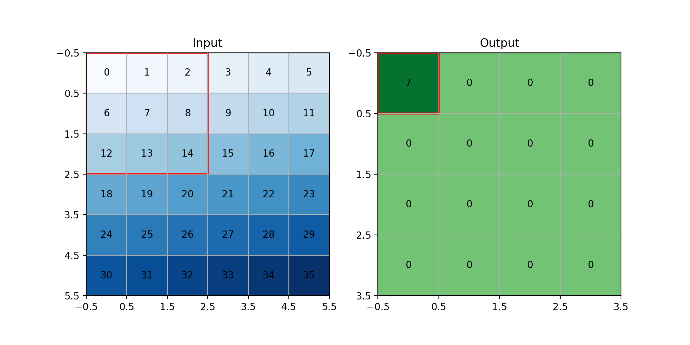

# Convolution

## Introduction

## Convolution operation

Convolution is an operation in which we slide a smaller matrix (kernel) over a bigger matrix and calculate the
weighted sum.
Let's explain its concepts using an example.
In our example, we have a `6x6` image, and our kernel is `3x3`, like below:

```python
image_size = (6, 6)
kernel_size = (3, 3)

image = np.arange(image_size[0] * image_size[1]).reshape(image_size)
kernel = np.ones(kernel_size) / (kernel_size[0] * kernel_size[1])

print("image:")
print(image)
print("kernel:")
print(kernel)

"""
--------
output: 

image:
[[ 0  1  2  3  4  5]
 [ 6  7  8  9 10 11]
 [12 13 14 15 16 17]
 [18 19 20 21 22 23]
 [24 25 26 27 28 29]
 [30 31 32 33 34 35]]
kernel:
[[0.11111111 0.11111111 0.11111111]
 [0.11111111 0.11111111 0.11111111]
 [0.11111111 0.11111111 0.11111111]]
"""
```

As you can see, our image is the numbers from `0` to `35`, and our kernel is working as an average kernel.
If we apply convolution, we are going to have a result like below:



As you can see in the GIF above, the kernel is being slid on our image, and we are getting the average of each `3x3`
block as an output.
Let's calculate the first block.

$$
0 \times \frac{1}{9} +
1 \times \frac{1}{9} +
2 \times \frac{1}{9} +
6 \times \frac{1}{9} +
7 \times \frac{1}{9} +
8 \times \frac{1}{9} +
12 \times \frac{1}{9} +
13 \times \frac{1}{9} +
14 \times \frac{1}{9} =
7
$$

As you can see, the calculations have the same results as the code.
Also, our input's shape is `6x6`, but our output's shape is `4x4`.
The reason behind that is our kernel is `3x3`.
So, we can only slide it `4` times on our input.
For now, we can calculate it like below:

$$
W_{out}=(W_{in}-K_{w}) + 1
$$

$$
H_{out}=(H_{in}-K_{h}) + 1
$$

* W: Width
* H: Height
* K: Kernel

Now, let's talk about 3 important things in **Convolution**.
If you want to experience different convolutions with different options,
you can use this code:
[conv_gif.py](https://github.com/LiterallyTheOne/Pytorch_Tutorial/blob/main/helpers/conv_gif.py).

### Stride

Right now, we are sliding our kernel `1` square at a time.
If we decide to slide it with a number different from one, we can use `stride`.


As you can see in the GIF above, we put the stride to `2`.
So, it slides `2` squares instead of `1` in both `x` and `y` axis.
As a result, our output's shape becomes half of what it was.
We can calculate the output's shape as below:

$$
W_{out}=\frac{(W_{in}-K_{w})}{S_{w}} + 1
$$

$$
H_{out}=\frac{(H_{in}-K_{h})}{S_{h}} + 1
$$

* W: Width
* H: Height
* K: Kernel
* S: Stride

### padding

Padding is a technique that we use to fill the surrounding of the input with some values.
The most common value for padding is `0`, which is called `zero padding`.
The main reason for that is to prevent our image from being shrunk after some convolutions.
In the previous example, you saw that the image with `6x6` becomes `4x4`.
If the input shape and output shape are the same, it is called `zero-padding`.


As you can see in the GIF above, we have added zeros to the surroundings of
our input.
As a result, our output has the same shape as our input (`6x6`).
We can calculate the output size as below:

$$
W_{out}=\frac{(W_{in}+2P_w-K_w)}{S_w} + 1
$$

$$
H_{out}=\frac{(H_{in}+2P_h-K_h)}{S_h} + 1
$$

* W: Width
* H: Height
* K: Kernel
* S: Stride
* P: Padding

### Dilation

Dilation is a technique that we use to make the kernel bigger to cover a bigger area.
To do so, we insert gaps between our kernel.
For example, if our kernel is like below:

$$
\begin{bmatrix}
1 & 2 & 3 \\
4 & 5 & 6 \\
7 & 8 & 9 \\
\end{bmatrix}
$$

After `dilation=2`, it becomes like below:

$$
\begin{bmatrix}
1 & 0 & 2 & 0 & 3 \\
0 & 0 & 0 & 0 & 0 \\
4 & 0 & 5 & 0 & 6 \\
0 & 0 & 0 & 0 & 0 \\
7 & 0 & 8 & 0 & 9 \\
\end{bmatrix}
$$


As you can see in the GIF above, we have `dilation=2`, so our kernel becomes `5x5`.
We can calculate the output shape with the formula below:

$$
W_{out}=\frac{(W_{in}+2P_w - D_w \times (K_w - 1) -1)}{S_w} + 1
$$

$$
H_{out}=\frac{(H_{in}+2P_h - D_h \times (K_h - 1) -1)}{S_h} + 1
$$

* W: Width
* H: Height
* K: Kernel
* S: Stride
* P: Padding
* D: Dilation

## Convolution layer

Earlier, we learned how `convolution` works.
Now, let's talk about how to use it in **Keras**.
We can define a `Convolution layer` in **Keras** like below:

```python
from keras.layers import Conv2D

conv_1 = Conv2D(
    filters=64,
    kernel_size=(3, 3),
    padding="same",
    strides=(1, 1),
    dilation_rate=(1, 1),
)

```

In the code above, we have defined a `convolution layer`.
For its output, it creates `64` channels.
Also, it has a `3x3` kernel.
As you can see, we have control over `stride`, `padding`, and `dilation`.
Now, let's feed our loaded images to `conv_1`, to see what happens.

```python
for images, labels in train_loader:
    images = Permute((2, 3, 1))(images)
    result = conv_1(images)
    print(f"images shape: {images.shape}")
    print(f"result shape: {result.shape}")
    break

"""
--------
output: 
images shape: torch.Size([12, 224, 224, 3])
result shape: torch.Size([12, 224, 224, 64])
"""
```

The results above show that the width and height of our inputs and outputs are the same.
The reason behind that is that we put `padding` to `same`.
Also, we have 64 channels for the results as expected.

## Activation layers

## Pooling layers

## LeNet

## AlexNet

## Your turn

## Conclusion
