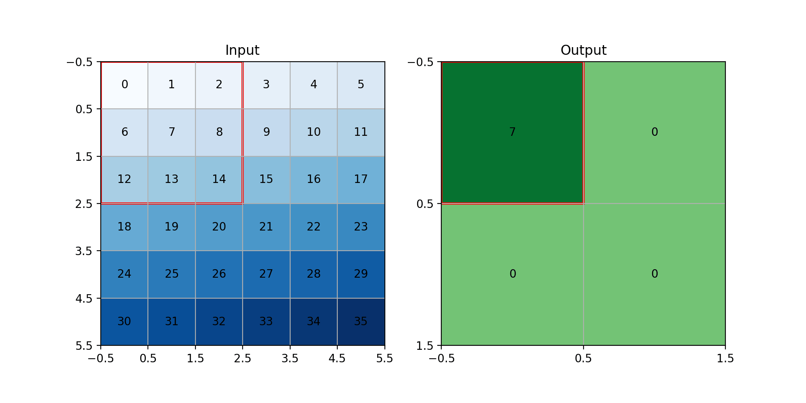
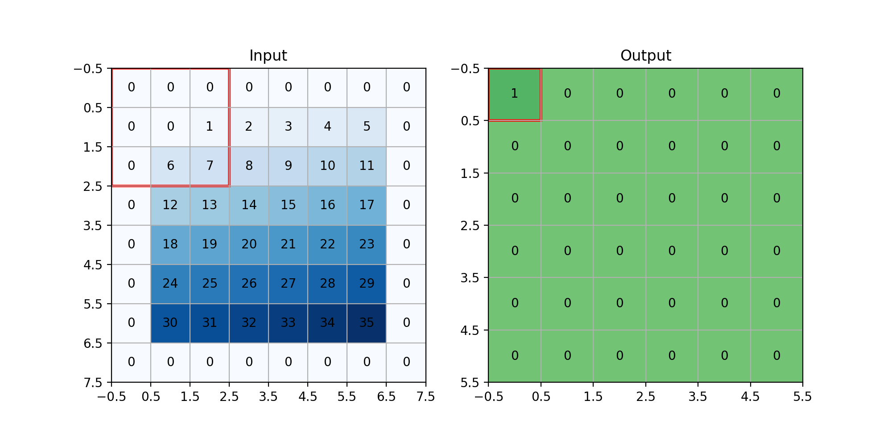
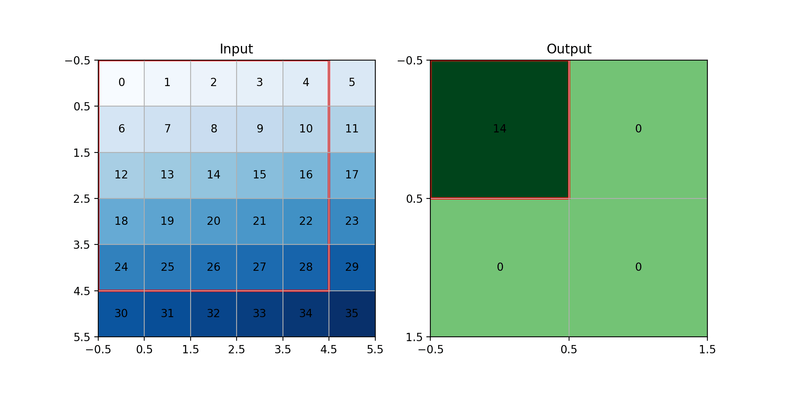
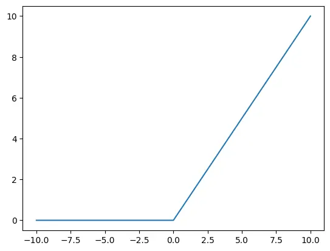
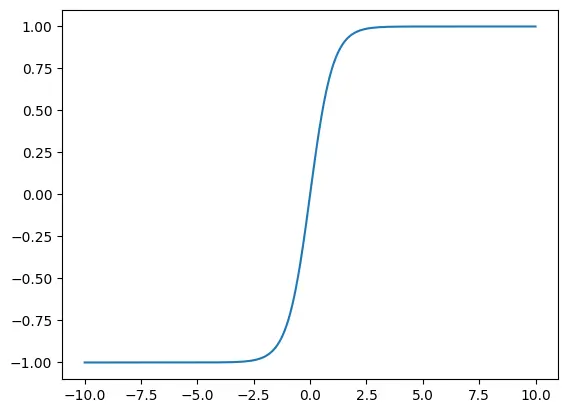
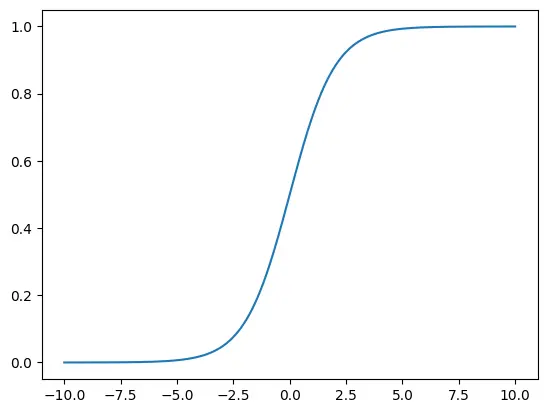
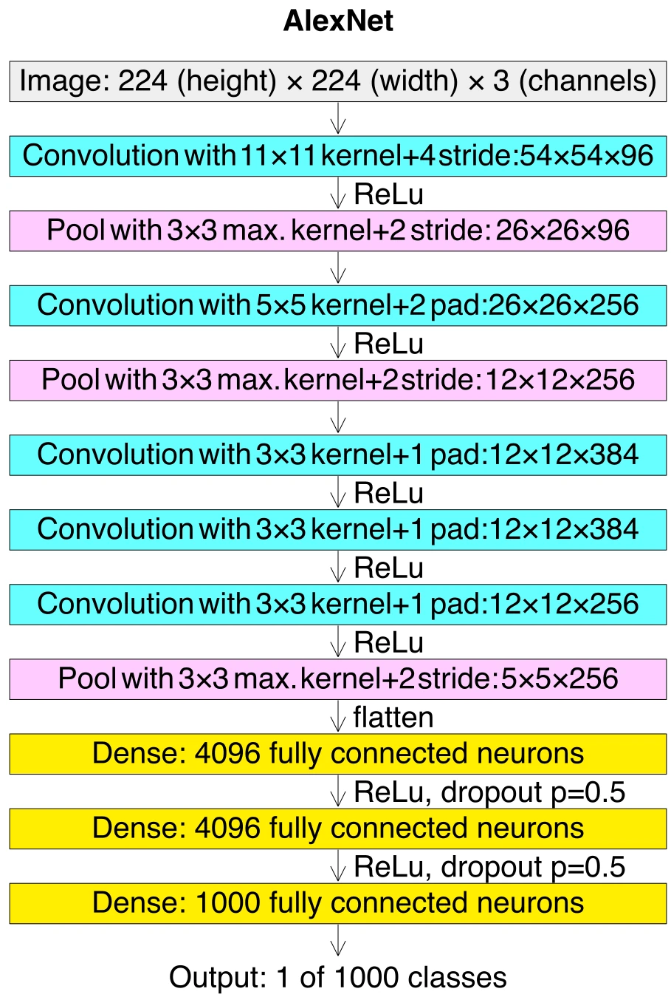

# Convolutional models

## Introduction

In the previous tutorial, we learned about different loss functions and optimizers.
In this tutorial, we will learn more about convolutional models that we were using in the previous tutorials.

## Convolution

Convolution is an operation in which we slide a smaller matrix (kernel) over a bigger matrix and calculate the
weighted sum.
Let's explain its concepts using an example.
In our example, we have a `6x6` image, and our kernel is `3x3`, like below:

```python
image_size = (6, 6)
kernel_size = (3, 3)

image = np.arange(image_size[0] * image_size[1]).reshape(image_size)
kernel = np.ones(kernel_size) / (kernel_size[0] * kernel_size[1])

print("image:")
print(image)
print("kernel:")
print(kernel)

"""
--------
output: 

image:
[[ 0  1  2  3  4  5]
 [ 6  7  8  9 10 11]
 [12 13 14 15 16 17]
 [18 19 20 21 22 23]
 [24 25 26 27 28 29]
 [30 31 32 33 34 35]]
kernel:
[[0.11111111 0.11111111 0.11111111]
 [0.11111111 0.11111111 0.11111111]
 [0.11111111 0.11111111 0.11111111]]
"""
```

As you can see, our image is the numbers from `0` to `35`, and our kernel is working as an average kernel.
If we apply convolution, we are going to have a result like below:


As you can see in the GIF above, the kernel is being slid on our image, and we are getting the average of each `3x3`
block as an output.
Let's calculate the first block.

$$
0 \times \frac{1}{9} +
1 \times \frac{1}{9} +
2 \times \frac{1}{9} +
6 \times \frac{1}{9} +
7 \times \frac{1}{9} +
8 \times \frac{1}{9} +
12 \times \frac{1}{9} +
13 \times \frac{1}{9} +
14 \times \frac{1}{9} =
7
$$

As you can see, the calculations have the same results as the code.
Also, our input's shape is `6x6`, but our output's shape is `4x4`.
The reason behind that is our kernel is `3x3`.
So, we can only slide it `4` times on our input.
For now, we can calculate it like below:

$$
W_{out}=(W_{in}-K_{w}) + 1
$$

$$
H_{out}=(H_{in}-K_{h}) + 1
$$

* W: Width
* H: Height
* K: Kernel

Now, let's talk about 3 important things in **Convolution**.
If you want to experience different convolutions with different options,
you can use this code:
[conv_gif.py](https://github.com/LiterallyTheOne/deep-learning-with-keras/blob/master/src/5-generalization/conv_gif.py).

### Stride

Right now, we are sliding our kernel `1` square at a time.
If we decide to slide it with a number different from one, we can use `stride`.



As you can see in the GIF above, we put the stride to `2`.
So, it slides `2` squares instead of `1` in both `x` and `y` axis.
As a result, our output's shape becomes half of what it was.
We can calculate the output's shape as below:

$$
W_{out}=\frac{(W_{in}-K_{w})}{S_{w}} + 1
$$

$$
H_{out}=\frac{(H_{in}-K_{h})}{S_{h}} + 1
$$

* W: Width
* H: Height
* K: Kernel
* S: Stride

### padding

Padding is a technique that we use to fill the surrounding of the input with some values.
The most common value for padding is `0`, which is called `zero padding`.
The main reason for that is to prevent our image from being shrunk after some convolutions.
In the previous example, you saw that the image with `6x6` becomes `4x4`.
If the input shape and output shape are the same, it is called `zero-padding`.



As you can see in the GIF above, we have added zeros to the surroundings of
our input.
As a result, our output has the same shape as our input (`6x6`).
We can calculate the output size as below:

$$
W_{out}=\frac{(W_{in}+2P_w-K_w)}{S_w} + 1
$$

$$
H_{out}=\frac{(H_{in}+2P_h-K_h)}{S_h} + 1
$$

* W: Width
* H: Height
* K: Kernel
* S: Stride
* P: Padding

### Dilation

Dilation is a technique that we use to make the kernel bigger to cover a bigger area.
To do so, we insert gaps between our kernel.
For example, if our kernel is like below:

$$
\begin{bmatrix}
1 & 2 & 3 \\
4 & 5 & 6 \\
7 & 8 & 9 \\
\end{bmatrix}
$$

After `dilation=2`, it becomes like below:

$$
\begin{bmatrix}
1 & 0 & 2 & 0 & 3 \\
0 & 0 & 0 & 0 & 0 \\
4 & 0 & 5 & 0 & 6 \\
0 & 0 & 0 & 0 & 0 \\
7 & 0 & 8 & 0 & 9 \\
\end{bmatrix}
$$



As you can see in the GIF above, we have `dilation=2`, so our kernel becomes `5x5`.
We can calculate the output shape with the formula below:

$$
W_{out}=\frac{(W_{in}+2P_w - D_w \times (K_w - 1) -1)}{S_w} + 1
$$

$$
H_{out}=\frac{(H_{in}+2P_h - D_h \times (K_h - 1) -1)}{S_h} + 1
$$

* W: Width
* H: Height
* K: Kernel
* S: Stride
* P: Padding
* D: Dilation

## Convolution layer

Earlier, we learned how `convolution` works.
Now, let's talk about how to use it in **Keras**.
We can define a `Convolution layer` in **Keras** like below:

```python
from keras.layers import Conv2D

conv_1 = Conv2D(
    filters=64,
    kernel_size=(3, 3),
    padding="same",
    strides=(1, 1),
    dilation_rate=(1, 1),
)

```

In the code above, we have defined a `convolution layer`.
For its output, it creates `64` channels.
Also, it has a `3x3` kernel.
As you can see, we have control over `stride`, `padding`, and `dilation`.
Now, let's feed our loaded images to `conv_1`, to see what happens.

```python
for images, labels in train_loader:
    images = Permute((2, 3, 1))(images)
    result = conv_1(images)
    print(f"images shape: {images.shape}")
    print(f"result shape: {result.shape}")
    break

"""
--------
output: 
images shape: torch.Size([12, 224, 224, 3])
result shape: torch.Size([12, 224, 224, 64])
"""
```

The results above show that the width and height of our inputs and outputs are the same.
The reason behind that is that we put `padding` to `same`.
Also, we have 64 channels for the results as expected.
When we train a convolution layer, this kernels would be trained.

## Pooling

**Pooling** is a downsampling operation.
It is mostly being used after feature extraction layers.
For example, after a series of **convolution layers**.
It is basically reduces the spatial dimensions (height, width) while keeping
the important information.

We are using a pooling layer mostly because:

* Compress information
* Avoid overfitting (which we are going to discuss in the upcoming tutorials)
* Achieving Translation Invariance
* Increase Receptive Field

The operation of **Pooling** is pretty similar to **Convolution**.  
We have a specific **Kernel** that we are sliding it over a bigger matrix.
The only difference between them, is that this **Kernel** is not trainable.
Let's get more familiar with two important **Pooling layers**,
**Average Pooling** and ** **Max pooling**.

### Average Pooling

**Average pooling** calculates the average of each window.
Here is an example of defining and using an **Average pooling layer** in **Keras**.

```python
from keras.layers import AveragePooling2D

avg_pooing_layer = AveragePooling2D((2, 2), strides=1)

a = np.arange(32, dtype=float).reshape(1, 4, 4, 2)

result = avg_pooing_layer(a).cpu().numpy()

print("differences in shapes")
print(a.shape)
print(result.shape)
print("-" * 20)

print("1st channel")
print(a[0, :, :, 0])
print("-" * 20)

print("second channel")
print(a[0, :, :, 1])
print("-" * 20)

print("result of the 1st channel")
print(result[0, :, :, 0])
print("-" * 20)

print("result of the 2nd channel")
print(result[0, :, :, 1])
print("-" * 20)

"""
--------
output: 

differences in shapes
(1, 4, 4, 2)
(1, 3, 3, 2)
--------------------
1st channel
[[ 0.  2.  4.  6.]
 [ 8. 10. 12. 14.]
 [16. 18. 20. 22.]
 [24. 26. 28. 30.]]
--------------------
second channel
[[ 1.  3.  5.  7.]
 [ 9. 11. 13. 15.]
 [17. 19. 21. 23.]
 [25. 27. 29. 31.]]
--------------------
result of the 1st channel
[[ 5.  7.  9.]
 [13. 15. 17.]
 [21. 23. 25.]]
--------------------
result of the 2nd channel
[[ 6.  8. 10.]
 [14. 16. 18.]
 [22. 24. 26.]]
--------------------

"""
```

As you can see, in the code above, we have defined an **Average Pooling Layer** with
the `pool_size` of `(2, 2)` and made sure that our `stride` is set to 1.
After that, we made an input matrix with the size of `4x4` that has 1 batch and 2 channels.
The values of this matrix is filled by the numbers in range of $[0, 31]$.
Then, we fed that input to our **Average pooling Layer** and printed the results.
As you can see, in the result section, we can see the differences of the input and the output.
First, let's examine the different shapes.
The original shape is `(1, 4, 4, 2)` but the output's shape is `(1, 3, 3, 2)`.
The reason behind that is that we can fit $3$ $2x2$ window on a $4x4$ matrix.
As you can see, we have printed each channel and the output is the average over the $2x2$ window.

There is another common **Pooling layer** is being used as the last layer of our convolutional model
(Instead of **Flatten**) is **Global Average Pooling**.
This layer, calculates the average of the whole channel.
Here is an example of **Global Average Pooling**.

```python
from keras.layers import GlobalAveragePooling2D

avg_pooing_layer = GlobalAveragePooling2D()

a = np.arange(32, dtype=float).reshape(1, 4, 4, 2)

result = avg_pooing_layer(a).cpu().numpy()

print("difference in shapes")
print(a.shape)
print(result.shape)
print("-" * 20)

print("1st channel")
print(a[0, :, :, 0])
print("-" * 20)

print("second channel")
print(a[0, :, :, 1])
print("-" * 20)

print("result")
print(result)
print("-" * 20)

"""
--------
output: 

difference in shapes
(1, 4, 4, 2)
(1, 2)
--------------------
1st channel
[[ 0.  2.  4.  6.]
 [ 8. 10. 12. 14.]
 [16. 18. 20. 22.]
 [24. 26. 28. 30.]]
--------------------
second channel
[[ 1.  3.  5.  7.]
 [ 9. 11. 13. 15.]
 [17. 19. 21. 23.]
 [25. 27. 29. 31.]]
--------------------
result
[[15. 16.]]
--------------------
"""
```

As you can see, in the code above, `GlobalAveragePooling2D` doesn't require a **Kernel**.
Because, it would apply the average on the whole channel.
As it shown in the outputs, the result shape is `(1, 2)` (batch_size and channel).
Also, you can see that the average of each channel is calculated.

### Max pooling

**Max Pooling** calculate the maximum of each window.
Here is an example of **Max Pooling**.

```python
from keras.layers import MaxPool2D

max_pooling_layer = MaxPool2D((2, 2), strides=1)

a = np.arange(32, dtype=float).reshape(1, 4, 4, 2)

result = max_pooling_layer(a).cpu().numpy()

print("differences in shapes")
print(a.shape)
print(result.shape)
print("-" * 20)

print("1st channel")
print(a[0, :, :, 0])
print("-" * 20)

print("second channel")
print(a[0, :, :, 1])
print("-" * 20)

print("result of the 1st channel")
print(result[0, :, :, 0])
print("-" * 20)

print("result of the 2nd channel")
print(result[0, :, :, 1])
print("-" * 20)

"""
--------
output: 

differences in shapes
(1, 4, 4, 2)
(1, 3, 3, 2)
--------------------
1st channel
[[ 0.  2.  4.  6.]
 [ 8. 10. 12. 14.]
 [16. 18. 20. 22.]
 [24. 26. 28. 30.]]
--------------------
second channel
[[ 1.  3.  5.  7.]
 [ 9. 11. 13. 15.]
 [17. 19. 21. 23.]
 [25. 27. 29. 31.]]
--------------------
result of the 1st channel
[[10. 12. 14.]
 [18. 20. 22.]
 [26. 28. 30.]]
--------------------
result of the 2nd channel
[[11. 13. 15.]
 [19. 21. 23.]
 [27. 29. 31.]]
--------------------
"""
```

As you can see, in the code above, the syntax of **Max Pooling** is pretty similar to **Average Pooling**.
The **Kernel** of our **Max Pooling** layer is also $2x2$ so the output shape would be the same as
**Average pooling**.
As you can see, in the output, the maximum of each window is calculated.

We have **Global Maximum Pooling as well**.
Here is an example:

```python
max_pooling_layer = GlobalMaxPooling2D()

a = np.arange(32, dtype=float).reshape(1, 4, 4, 2)

result = max_pooling_layer(a).cpu().numpy()

print("difference in shapes")
print(a.shape)
print(result.shape)
print("-" * 20)

print("1st channel")
print(a[0, :, :, 0])
print("-" * 20)

print("second channel")
print(a[0, :, :, 1])
print("-" * 20)

print("result")
print(result)
print("-" * 20)

"""
--------
output: 

difference in shapes
(1, 4, 4, 2)
(1, 2)
--------------------
1st channel
[[ 0.  2.  4.  6.]
 [ 8. 10. 12. 14.]
 [16. 18. 20. 22.]
 [24. 26. 28. 30.]]
--------------------
second channel
[[ 1.  3.  5.  7.]
 [ 9. 11. 13. 15.]
 [17. 19. 21. 23.]
 [25. 27. 29. 31.]]
--------------------
result
[[30. 31.]]
--------------------
"""
```

As you can see, the maximum of each channel is calculated

## Activation Function

In a Neural Networks, **Activation functions** removes the linearity of the connections.
Without an **Activation Function**, the model is only a linear transformation.
It helps the model to learn complex relationships.
In **Keras**, we can give an activation function to the layer.
This was the method that we were using in the previous tutorials.

We have so many different **Activation functions**.
Here are one of the most used ones.

### ReLU

`ReLU` stands for `Rectified Linear Unit`.
It is one of the most used activation functions in **Deep Learning**.
The logic behind that is pretty simple.
It only changes the negative values to `0`.
Here is its formula:

$$
ReLU(x) = max(0, x)
$$



You can access the **ReLU** function like below:

```python
from keras.activations import relu
```

### Tanh

**Hyperbolic Tangent function** is another super useful **Activation Functions**.
It maps its input into the range of $(-1, 1)$

$$
\tanh(x) = \frac{e^x - e^{-x}}{e^x + e^{-x}}
$$



You can access the **Tanh** function like below:

```python
from keras.activations import tanh
```

### Sigmoid

**Sigmoid** is another function that is mostly used in binary classification.
It would map the input into the range of $(0, 1)$.

$$
\sigma(x) = \frac{1}{1 + e^{-x}}
$$



You can access the **Sigmoid** function like below:

```python
from keras.activations import sigmoid

```

### Softmax

**Softmax** is mostly used as the **Activation function** of the final layer of classification.
It would change the logits to the probability.

$$
\text{Softmax}(z_i) = \frac{e^{z_i}}{\sum_j e^{z_j}}
$$

You can access the **Softmax** function like below:

```python
from keras.activations import softmax

```

## Dropout layer

**Dropout layer** is a technique that is used to avoid overfitting and achieve regularization.
It accepts a percentage as its input.
In each training step, it would set that percentage of neurons to zero.
This helps the other neurons to get included in the training procedure.

Here is an example of the usage of the **Dropout layer**.

```python
from keras import Sequential
from keras.layers import Dropout, Dense, Input

model = Sequential(
    [
        Input(shape=(1024,)),
        Dropout(0.2),
        Dense(512, activation="relu"),
        Dropout(0.2),
        Dense(128, activation="relu"),
        Dropout(0.2),
        Dense(10, activation="relu"),
    ]
)
```

## LeNet

Now that we have learned about the layers that are mostly used in **Convolutional Neural Networks**,
let's build some of them from scratch.
One of the most effective and simple models is **LeNet**.
**LeNet** is designed to recognize the handwritten digits on grayscale $28x28$ images.


> **Image Source**: https://en.wikipedia.org/wiki/LeNet#/media/File:Comparison_image_neural_networks.svg

Here is the
[link](https://github.com/LiterallyTheOne/deep-learning-with-keras/blob/main/src/5-convolutional-models/a6_LeNet.ipynb)
to the implementation of **LeNet** part by part in **Keras**.

## AlexNet

**AlexNet** is another important **Convolutional Neural Network** that is being recognized as the beginning
of the **Deep Learning**.
It is officially designed to the classification task in a dataset called **ImageNet**.
**ImageNet** is a huge dataset with $1000$ classes.
The images of this dataset is in **RGB** format and the shape of them are $224x224$.
Here is the architecture of **AlexNet**.



> **Source**: https://en.wikipedia.org/wiki/LeNet#/media/File:Comparison_image_neural_networks.svg

Here is the
[link](https://github.com/LiterallyTheOne/deep-learning-with-keras/blob/main/src/5-convolutional-models/a7_AlexNet.ipynb)
to the implementation of **LeNet** part by part in **Keras**.

## Your turn

## Conclusion
