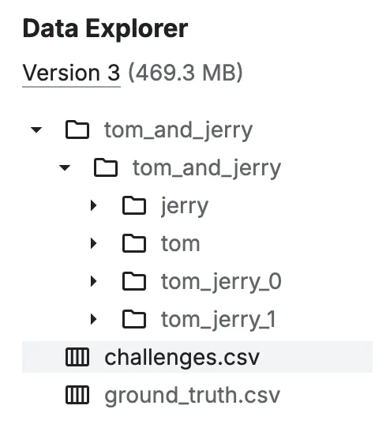
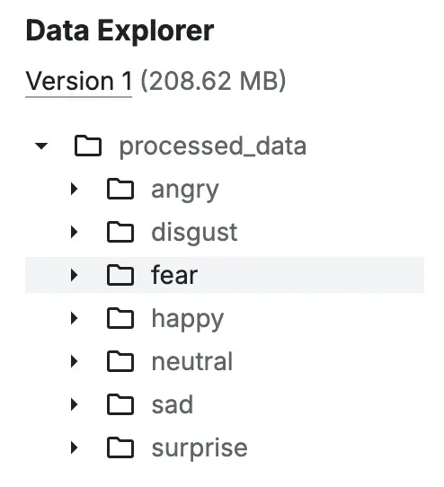

<style scoped>
p {
  color: cyan;
}
</style>

<!-- _header: "" -->
<!-- _footer: "" -->

# Deep Learning with Keras

By LiterallyTheOne

## 0: Introduction


---
<!-- paginate: true -->

## Keras

* High level API
* Building and Training Deep Learning Models
* Tensorflow, PyTorch, Jax

---

## Why Keras?

* Super easy to start with
* Train and test with only a few lines
* Can start a practical project really fast

---

## Google Colab

* One of the best ways to run Python
* Free
* Cloud-based
* Jupyter notebook
* All the codes in this tutorial can be executed on it

---

## Open a GitHub notebook into Colab

* All the codes are available in GitHub


---

## Hello World: Setup

```python
import os

os.environ["KERAS_BACKEND"] = "torch"
```

---

## Hello World: Imports

```python
from keras.datasets import mnist
import keras
from keras import layers
```

---

## Hello World: Prepare Data

```python
(train_images, train_labels), (test_images, test_labels) = mnist.load_data()

train_images = train_images.reshape((60000, 28 * 28))
train_images = train_images.astype("float32") / 255
test_images = test_images.reshape((10000, 28 * 28))
test_images = test_images.astype("float32") / 255
```

---

## Hello World: Define the model

```python
model = keras.Sequential([
    layers.Dense(512, activation="relu"),
    layers.Dense(10, activation="softmax")
])

model.compile(optimizer="adam",
              loss="sparse_categorical_crossentropy",
              metrics=["accuracy"])
```

---

## Hello World: Train the model

```python
model.fit(train_images, train_labels, epochs=5, batch_size=128)
```

---

## Hello World: Test the model

```python
test_loss, test_acc = model.evaluate(test_images, test_labels)
```

---

## Hello World: Output

```python
"""
--------
output: 

Epoch 1/5
469/469 ━━━━━━━━━━━━━━━━━━━━ 2s 5ms/step - accuracy: 0.9259 - loss: 0.2622
Epoch 2/5
469/469 ━━━━━━━━━━━━━━━━━━━━ 2s 5ms/step - accuracy: 0.9685 - loss: 0.1092
Epoch 3/5
469/469 ━━━━━━━━━━━━━━━━━━━━ 2s 5ms/step - accuracy: 0.9797 - loss: 0.0710
Epoch 4/5
469/469 ━━━━━━━━━━━━━━━━━━━━ 2s 5ms/step - accuracy: 0.9852 - loss: 0.0515
Epoch 5/5
469/469 ━━━━━━━━━━━━━━━━━━━━ 2s 5ms/step - accuracy: 0.9901 - loss: 0.0363
313/313 ━━━━━━━━━━━━━━━━━━━━ 1s 3ms/step - accuracy: 0.9801 - loss: 0.0616
"""
```

---

## Kaggle

* A platform:
  * Data Science
  * Machine learning
* Datasets
* Competitions
* Pretrained Models

---

## Image Classification Dataset

* tag: Image Classification
* Dataset structure:

```text
class_a/
...a_image_1.jpg
...a_image_2.jpg
class_b/
...b_image_1.jpg
...b_image_2.jpg
```

---

## Example 1

* [Tom and Jerry Image classification](https://www.kaggle.com/datasets/balabaskar/tom-and-jerry-image-classification)



---

## Example 2

* [Facial Emotion Recognition Dataset](https://www.kaggle.com/datasets/fahadullaha/facial-emotion-recognition-dataset)



---

## Assignment

* Select a dataset from Kaggle

  * Image classification
  * Each class has its own directory, and its images are in that directory
  * It's better for our dataset size not to exceed $5$GB.
  * Each dataset should be unique
  * Should not be a **Well-known** Dataset.

---

## Link to the tutorial and materials


