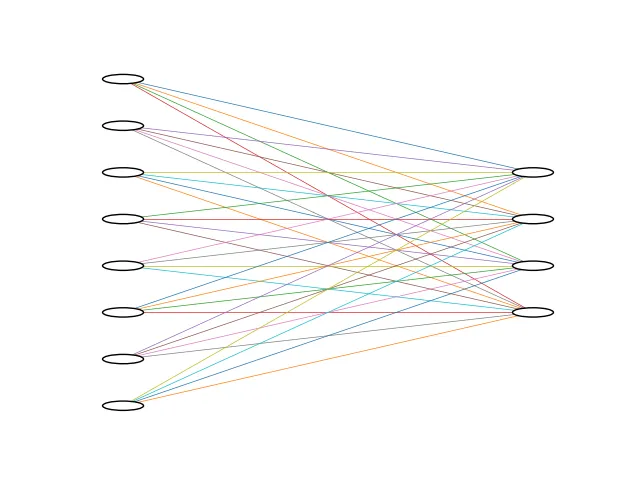

<style scoped>
p {
  color: cyan;
}
</style>

<!-- _header: "" -->
<!-- _footer: "" -->

# Deep Learning with Keras

By LiterallyTheOne

## 2: Model and Transfer Learning


---
<!-- paginate: true -->

## Introduction

* Previous Tutorial: Load a dataset Correctly
* This Tutorial: Model and Transfer Learning

---

<style scoped>
  pre {
    font-size: 20px; /* Adjust this value to your desired size */
  }
</style>

## Loading Data

```python
path = kagglehub.dataset_download("balabaskar/tom-and-jerry-image-classification")

data_path = Path(path) / "tom_and_jerry/tom_and_jerry"

trs = transforms.Compose(
    [
        transforms.Resize((224, 224)),
        transforms.ToTensor(),
    ]
)

all_data = ImageFolder(data_path, transform=trs)

g1 = torch.Generator().manual_seed(20)
train_data, val_data, test_data = random_split(all_data, [0.7, 0.2, 0.1], g1)

train_loader = DataLoader(train_data, batch_size=12, shuffle=True)
val_loader = DataLoader(val_data, batch_size=12, shuffle=False)
test_loader = DataLoader(test_data, batch_size=12, shuffle=False)
```

---

## Model in Keras

* Sequential
* Functional
* Subclassing

---

## Sequential

* List of layers
* Passes the output of a layer to the next

```python
model = keras.Sequential(
    [
    ],
)
```

---

## Input Layer

* Define our input shape

```python
input_layer = keras.layers.Input(shape=(3, 224, 224))
```

---

## Add Input layer to the model

```python
model = keras.Sequential(
    [
        keras.layers.Input(shape=(3, 224, 224)),
    ],
)
```

---

## Dense layer

* Fully Connected Layer



---

## Dense layer in Keras

* 10 neurons
* activitation function: `relu`

```python
dense_layer = keras.layers.Dense(10, activation="relu")
```

---

## Output layer

* 4 classes: 4 output neurons
* activation: `softmax`

```python
keras.layers.Dense(4, activation="softmax"),
```

---

## Add Output layer to the model

```python
model = keras.Sequential(
    [
        keras.layers.Input(shape=(3, 224, 224)),
        keras.layers.Dense(4, activation="softmax"),
    ],
)
```

---

## Flatten layer

* output: 1D

```python
flatten_layer = keras.layers.Flatten()
```

---

## Add Flatten layer to the model

```python
model = keras.Sequential(
    [
        keras.layers.Input(shape=(3, 224, 224)),
        keras.layers.Flatten(),
        keras.layers.Dense(4, activation="softmax"),
    ],
)
```

---

## Compile

* `loss_function`
* `optimizer`
* `metrics`

```python
model.compile(
    optimizer="adam",
    loss="sparse_categorical_crossentropy",
    metrics=["accuracy"],
)
```

---

## Model Details

<style scoped>
  pre {
    font-size: 22px; /* Adjust this value to your desired size */
  }
</style>

```python
print(model.summary())

"""
--------
output: 

Model: "sequential_3"
┏━━━━━━━━━━━━━━━━━━━━━━━━━━━━━━━━━┳━━━━━━━━━━━━━━━━━━━━━━━━┳━━━━━━━━━━━━━━━┓
┃ Layer (type)                    ┃ Output Shape           ┃       Param # ┃
┡━━━━━━━━━━━━━━━━━━━━━━━━━━━━━━━━━╇━━━━━━━━━━━━━━━━━━━━━━━━╇━━━━━━━━━━━━━━━┩
│ flatten (Flatten)               │ (None, 150528)         │             0 │
├─────────────────────────────────┼────────────────────────┼───────────────┤
│ dense_1 (Dense)                 │ (None, 4)              │       602,116 │
└─────────────────────────────────┴────────────────────────┴───────────────┘
 Total params: 602,116 (2.30 MB)
 Trainable params: 602,116 (2.30 MB)
 Non-trainable params: 0 (0.00 B)
"""
```

---

## Feed data to our model

* `batch_size`: 12

```python
for images, labels in train_loader:
    result = model(images)
    print(result.shape)
    break


"""
--------
output: 

torch.Size([12, 4])
"""
```

---

## Train the model

* fit function

```python
history = model.fit(train_loader, epochs=5, validation_data=val_loader)

"""
--------
output: 

Epoch 1/5
320/320 ━━━━━━━━━━━━━━━━━━━━ 19s 59ms/step - accuracy: 0.3536 - loss: 10.3647 - val_accuracy: 0.3449 - val_loss: 10.5572
Epoch 2/5
320/320 ━━━━━━━━━━━━━━━━━━━━ 17s 55ms/step - accuracy: 0.3544 - loss: 10.3956 - val_accuracy: 0.3449 - val_loss: 10.5387
Epoch 3/5
320/320 ━━━━━━━━━━━━━━━━━━━━ 18s 55ms/step - accuracy: 0.3546 - loss: 10.3916 - val_accuracy: 0.3449 - val_loss: 10.5626
Epoch 4/5
320/320 ━━━━━━━━━━━━━━━━━━━━ 17s 53ms/step - accuracy: 0.3541 - loss: 10.4005 - val_accuracy: 0.3449 - val_loss: 10.5625
Epoch 5/5
320/320 ━━━━━━━━━━━━━━━━━━━━ 17s 53ms/step - accuracy: 0.3541 - loss: 10.4005 - val_accuracy: 0.3449 - val_loss: 10.5624
"""
```

---

## Evaluate the model

```python
loss, accuracy = model.evaluate(test_loader)

print("loss:", loss)
print("accuracy:", accuracy)


"""
--------
output: 
46/46 ━━━━━━━━━━━━━━━━━━━━ 2s 44ms/step - accuracy: 0.3638 - loss: 10.2543
loss: 10.254292488098145
accuracy: 0.36380255222320557
"""
```

---

## Transfer Learning

* Deep learning technique
* Super common
* use pretrained model (called base model)
* on a new dataset with a different purpose.
* Feature extractor
* **Don't train the `base_model`**

---

## Transfer Learning steps

* Load the model without its classification layers
* Put the training of the base model to `False`
* Change the input layer according to the dataset input
* Change the output layer according to the number of classes

---

## MobileNetV2

* Famous
* Used widely
* Light
* Good generalization

---

## Load MobileNetV2

```python
from keras.applications import MobileNetV2

base_model = MobileNetV2(include_top=False, input_shape=(224, 224, 3))

base_model.trainable = False
```

> Different models available in **Keras**: <https://keras.io/api/applications/>

---

## Images shape vs model's input shape

* Our images:
  * (channel, height, width)
  * (3 ,224, 224)
* Our model's input:
  * (height, width, channel)
  * (224, 224, 3)

---

## Permute layer

```python
p = layers.Permute((2, 3, 1))

for images, labels in train_loader:
    print(f"result shape: {p(images).shape}")
    break

"""
--------
output: 

result shape: torch.Size([12, 224, 224, 3])
"""
```

---

## Apply Transfer Learning

```python
model = keras.Sequential(
    [
        layers.Input(shape=(3, 224, 224)),
        layers.Permute((2, 3, 1)),
        base_model,
        layers.Flatten(),
        layers.Dense(4, activation="softmax"),
    ]
)
```

---

## Compile the model

```python
model.compile(
    optimizer="adam",
    loss="sparse_categorical_crossentropy",
    metrics=["accuracy"],
)
```

---

## See the model's details

<style scoped>
  pre {
    font-size: 16px; /* Adjust this value to your desired size */
  }
</style>

```python
print(model.summary())


"""
--------
output: 

Model: "sequential_4"
┏━━━━━━━━━━━━━━━━━━━━━━━━━━━━━━━━━┳━━━━━━━━━━━━━━━━━━━━━━━━┳━━━━━━━━━━━━━━━┓
┃ Layer (type)                    ┃ Output Shape           ┃       Param # ┃
┡━━━━━━━━━━━━━━━━━━━━━━━━━━━━━━━━━╇━━━━━━━━━━━━━━━━━━━━━━━━╇━━━━━━━━━━━━━━━┩
│ permute_1 (Permute)             │ (None, 224, 224, 3)    │             0 │
├─────────────────────────────────┼────────────────────────┼───────────────┤
│ mobilenetv2_1.00_224            │ (None, 7, 7, 1280)     │     2,257,984 │
│ (Functional)                    │                        │               │
├─────────────────────────────────┼────────────────────────┼───────────────┤
│ flatten_1 (Flatten)             │ (None, 62720)          │             0 │
├─────────────────────────────────┼────────────────────────┼───────────────┤
│ dense_2 (Dense)                 │ (None, 4)              │       250,884 │
└─────────────────────────────────┴────────────────────────┴───────────────┘
 Total params: 2,508,868 (9.57 MB)
 Trainable params: 250,884 (980.02 KB)
 Non-trainable params: 2,257,984 (8.61 MB)
"""
```

---

## Train the new model

```python
history = model.fit(train_loader, epochs=5, validation_data=[val_loader])

"""
--------
output: 

Epoch 1/5
320/320 ━━━━━━━━━━━━━━━━━━━━ 40s 125ms/step - accuracy: 0.3252 - loss: 10.4311 - val_accuracy: 0.4133 - val_loss: 8.8533
Epoch 2/5
320/320 ━━━━━━━━━━━━━━━━━━━━ 42s 133ms/step - accuracy: 0.4383 - loss: 8.7707 - val_accuracy: 0.4434 - val_loss: 8.7051
Epoch 3/5
320/320 ━━━━━━━━━━━━━━━━━━━━ 46s 145ms/step - accuracy: 0.4634 - loss: 8.3851 - val_accuracy: 0.4653 - val_loss: 8.2721
Epoch 4/5
320/320 ━━━━━━━━━━━━━━━━━━━━ 45s 142ms/step - accuracy: 0.5014 - loss: 7.8171 - val_accuracy: 0.5046 - val_loss: 7.7342
Epoch 5/5
320/320 ━━━━━━━━━━━━━━━━━━━━ 47s 146ms/step - accuracy: 0.5291 - loss: 7.4392 - val_accuracy: 0.5301 - val_loss: 7.3093
"""
```

* loss and accuracy are improving

---

## Evaluate the new model

```python
loss, accuracy = model.evaluate(test_loader)

print("loss:", loss)
print("accuracy:", accuracy)

"""
--------
output: 

46/46 ━━━━━━━━━━━━━━━━━━━━ 5s 111ms/step - accuracy: 0.4845 - loss: 8.0948
loss: 8.0947847366333
accuracy: 0.4844606816768646
"""
```

---

## Your Turn

<style scoped>
  {
    font-size: 30px; /* Adjust this value to your desired size */
  }
</style>

* Load your dataset in 3 subsets: **train**, **validation**, and **test**.
* Choose another model other than `MobileNetV2` as your base model.
  * You can use this link to see the other models
  * <https://keras.io/api/applications/>
* Set the input layer according to your data
* Set the output layer according to the number of the classes
* Use the transfer learning technique correctly
* Train your model on your train subset
  * You should fill `validation_data` argument
  * 5 epochs is enough
* Report your result on your test subset

---

## Link to the tutorial and materials


